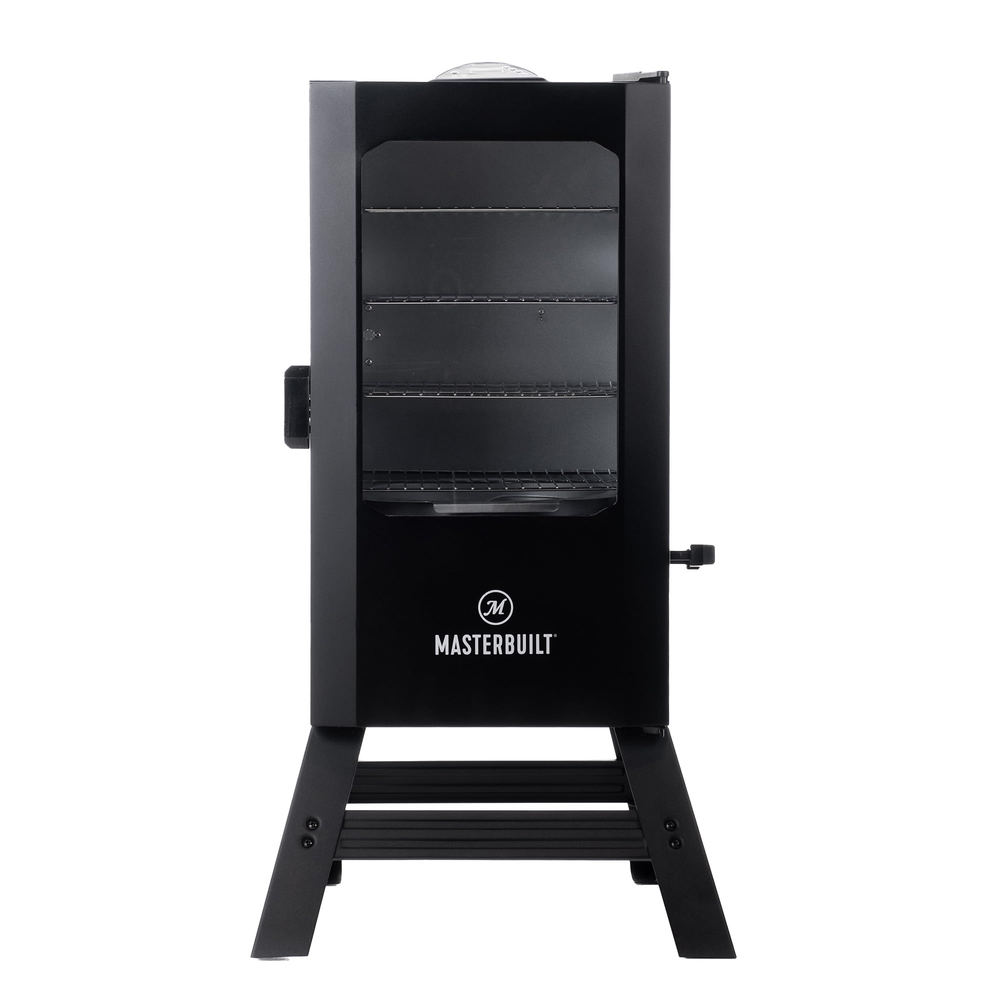

# Masterbuilt smoker in Home Assistant (ESPHome)

Get your Bluetooth Masterbuilt electric smoker into Home Assistant with a cheap ESP32 and
[ESPHome](https://esphome.io). You get live chamber temperature, set/target temp, cook time, time
remaining, and up to four meat probes as normal HA sensors, and you can optionally control the smoker
too.

No cloud, no phone app sitting on the counter, no account. The ESP32 talks to the smoker directly over
Bluetooth and publishes to Home Assistant.

<p align="center">
  
</p>

## Does this work with my smoker?

It's for the Masterbuilt electric smokers that pair over Bluetooth with the old "Masterbuilt" phone
app. Quick test:

> If the Masterbuilt app connects to your smoker over Bluetooth, and the smoker shows up in a BLE
> scanner as "Masterbuilt Smoker", this should work.

These units use a Bough Tech "BG536" BLE module and the two-round handshake written up in
[`docs/protocol.md`](docs/protocol.md).

- Confirmed on the 30" Digital Electric Vertical (the black cabinet with the front window and the side
  wood-chip loader, Masterbuilt's MB200704xx / MB20073519 family of Bluetooth verticals).
- Probably works on other Masterbuilt smokers that use the same app. Try it and open an issue with
  your model either way.
- Not for the Gravity Series / Wi-Fi / 940-series models, which use a different app.

## What you need

- An ESP32 dev board (any common `esp32dev` board), kept in Bluetooth range of the smoker and powered
  over USB.
- [ESPHome](https://esphome.io/guides/installing_esphome.html). The Home Assistant add-on is easiest.

## Setup

### 1. Create your config

Copy [`smoker.example.yaml`](smoker.example.yaml) and add a `secrets.yaml` with your Wi-Fi
credentials. The config pulls the component straight from GitHub:

```yaml
external_components:
  - source: github://webb64b/masterbuilt-smoker-esphome
    components: [masterbuilt_smoker]
```

### 2. Flash and pair (one time)

Flash the ESP32 over USB, then put the smoker in pairing mode once while the ESP32 is running.

Use whatever pairing step your smoker's manual describes. It's the same one you'd use for the phone
app. On the 30" digital electric vertical that's pressing and holding the Bluetooth button on the
panel until the display reads "pair." The ESP32 finds the smoker, grabs the pairing code, finishes the
handshake, and saves the smoker's identity to flash.

After that it reconnects on its own, after a reboot or a power cycle or anything else, with no pairing
button, just like the phone app's connect. You only pair again if you reset the device or move it to
another smoker.

> Heads up: the smoker only allows one Bluetooth connection at a time. While the ESP32 is connected
> the phone app can't connect, and the other way around.

> Safety: out of the box this only reads telemetry. It can optionally control the smoker too (see
> below); if you turn that on, read the safety note there. The Bluetooth link is unencrypted, so keep
> the ESP32 somewhere you trust, and don't treat Home Assistant as a safety interlock or a substitute
> for keeping an eye on the smoker.

### Re-pairing or moving to another smoker

The smoker identity is saved in ESPHome preferences after the first pairing. To move the ESP32 to a
different smoker, press the "Forget Saved Smoker Pairing" button in Home Assistant, then put the new
smoker in pairing mode while the ESP32 is running.

### Optional: pin a specific smoker

By default the ESP32 grabs the first compatible smoker it sees. If you've got more than one in range,
set `smoker_mac` under `masterbuilt_smoker`:

```yaml
masterbuilt_smoker:
  id: smoker
  ble_client_id: smoker_client
  smoker_mac: BC:33:AC:E0:E1:27
```

## Sensors

| Sensor | Notes |
| --- | --- |
| Chamber Temperature | Current cabinet temperature (°F) |
| Target Temperature | Set temperature (0 when no cook is set) |
| Cook Time | Set cook time (minutes) |
| Time Remaining | Remaining cook time (minutes) |
| Meat Probe 1-4 | Probe temperatures; `unknown` when a probe isn't plugged in |

## Controlling the smoker (optional)

The component can also drive the smoker the way the phone app does. These are optional. Leave them out
of the config and it stays read-only.

| Control | What it does |
| --- | --- |
| Smoker (climate) | Off / Heat with an adjustable target temp. The bottom (smoke) element. |
| Broil (select) | Off / Low / Medium / High. The top (broiler) element. |
| Cook Timer (number) | Cook time in minutes |
| Probe 1 Target (number) | Meat-probe alarm temperature |
| Door (binary sensor) | Open / closed |
| Temperature Error (binary sensor) | Sensor fault flag |

The smoke (bottom) and broil (top) elements are mutually exclusive, same as the smoker's panel:
turning broil on turns the smoke off (the climate reads Off), and turning the climate on turns broil
off. The broiler is a Low/Medium/High level, not a free temperature, because that's all the smoker
accepts over Bluetooth.

> Safety: these controls really do power the smoker on, set its temperature, and run the broiler. The
> smoker has its own door interlock and won't start heating with the door open, and this component
> leaves that to the smoker rather than second-guessing it. Don't treat Home Assistant as a safety
> interlock or a substitute for watching the smoker. The Bluetooth link is unencrypted, so keep the
> ESP32 somewhere you trust.

## How it works

The smoker uses an undocumented two-round challenge/response over a plain, unencrypted BLE GATT link.
The whole thing (the keyed handshake, the deliberate mid-handshake disconnect, the telemetry and
control frames) is written up in [`docs/protocol.md`](docs/protocol.md).

It assumes the Bough Tech BG536 handle layout from that doc. If a different Masterbuilt variant shows
up as "Masterbuilt Smoker" but uses different GATT handles, open an issue with the model number and an
ESPHome debug log.

## License

[MIT](LICENSE).
